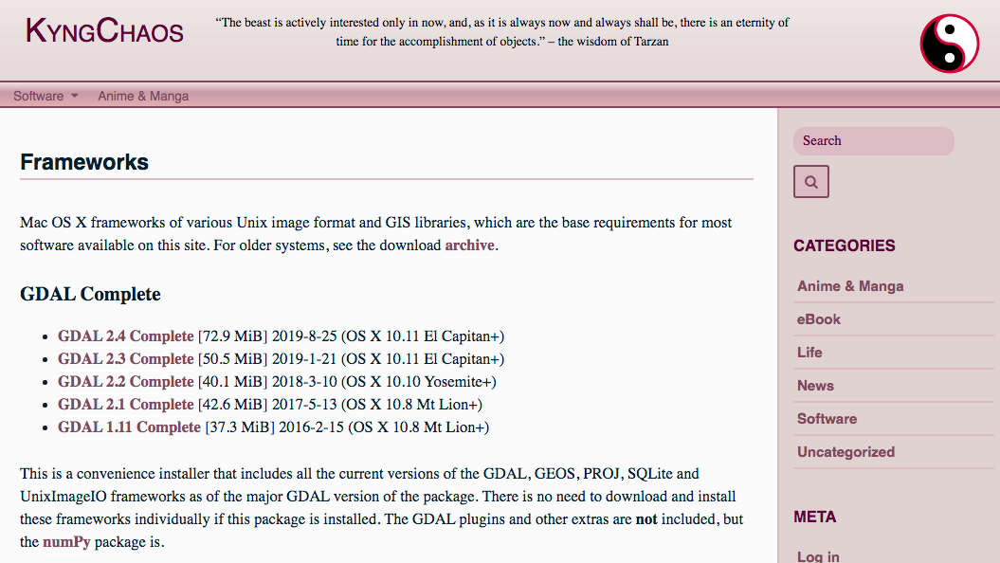
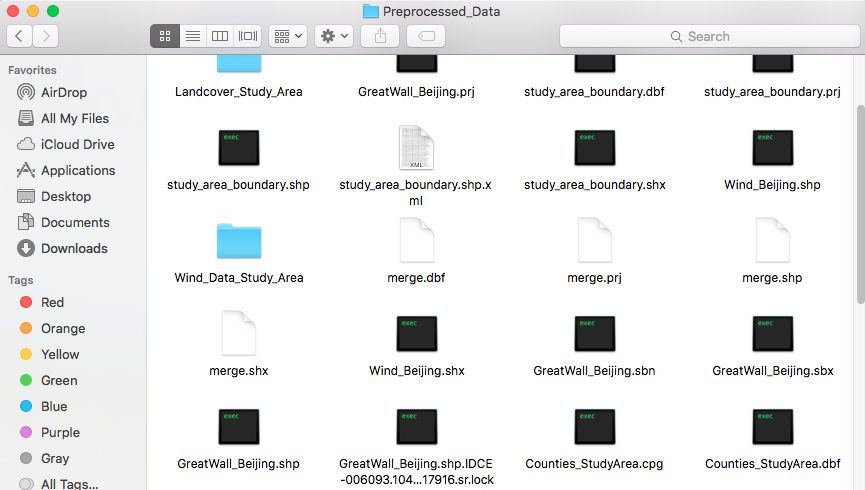

# GDAL Exploration 
By Ahna Knudsen 


### Data must have spatial aspect.
Supported formats:
- **Raster:** GeoTiff, JPEG, Erdas Imagine, DTED, and more
- **Vector:** ESRI Shapefile, ESRI ArcSDE, ESRI FileGDB, KML, PostGIS, and more

## Uses of GDAL:
Coordinate system conversion, statistics, format conversion, geo operations, image merge, etc. 


Two interfaces: API or command line
### 1. GDAL API:
- Library with classes and functions
- Input and output of spatial data, as well as other functions including reprojection, resampling, stretching, and more.
### 2. GDAL Command Line (Terminal)
Common commands:
- ``` Gdalinfo ```: raster data and metadata querying 
- ``` Gdal_translate ```: raster data format conversion, clipping, scaling
- ``` Gdalwarp ```: raster data reprojection, resizing, clipping, and mosaicing 
- ``` Ogrinfo ```: vector data and metadata querying
- ``` Ogr2ogr ```: vector data format conversion, merging, reprojecting, clipping, etc

## Download Process:
- Attempted to download QGIS 
- Opened terminal 
- Downloaded GDAL: 
  - http://www.kyngchaos.com/software/frameworks/
  
  
- Check to make sure download worked 
  - ```echo ```
- Download spatial data

## Installation: 

### Did not work:
- ``` ogr2ogr ```
- ``` brew install gdal2 ```
- ``` gdalinfo --version ```
Gave error: "Command not found" due to an error with the path set up
### Fix Path Set Up:
- ``` echo 'export PATH=/Library/Frameworks/GDAL.framework/Programs:$PATH' >> ~/.bash_profile ```
- ``` source ~/.bash_profile ```
### Check installation:
``` gdalinfo --version ```
Ouput: GDAL 2.4.2, released 2019/06/28

## Download Sample Data:
- Natural Earth: “Natural Earth II is a raster map dataset that portrays the world environment in an idealized manner with little human influence. “
  - https://www.naturalearthdata.com/downloads/10m-raster-data/10m-natural-earth-2/
  
  
  
- Beijing data: Advanced Vector class share
  - Raster and Vector (Powerlines, Great Wall of China, Wind Speeds, and DEM)


## Notes for Navigating in Terminal:
- use ```cd``` then name of folder to move between directories (think of directories as folders)
  - ex. ``` cd Downloads ```
- use ```cd ../``` to go back to previous direcotry 

## Executing Functions:
- Move shapefiles to geopackage
- Merge shapefiles

#### Check if GDAL is functioning 

``` gdal_translate ```
- Output:
```Usage: gdal_translate [--help-general] [--long-usage]
       [-ot {Byte/Int16/UInt16/UInt32/Int32/Float32/Float64/
             CInt16/CInt32/CFloat32/CFloat64}] [-strict]
       [-of format] [-b band] [-mask band] [-expand {gray|rgb|rgba}]
       [-outsize xsize[%]|0 ysize[%]|0] [-tr xres yres]
       [-r {nearest,bilinear,cubic,cubicspline,lanczos,average,mode}]
       [-unscale] [-scale[_bn] [src_min src_max [dst_min dst_max]]]* [-exponent[_bn] exp_val]*
       [-srcwin xoff yoff xsize ysize] [-epo] [-eco]
       [-projwin ulx uly lrx lry] [-projwin_srs srs_def]
       [-a_srs srs_def] [-a_ullr ulx uly lrx lry] [-a_nodata value]
       [-a_scale value] [-a_offset value]
       [-gcp pixel line easting northing [elevation]]*
       |-colorinterp{_bn} {red|green|blue|alpha|gray|undefined}]
       |-colorinterp {red|green|blue|alpha|gray|undefined},...]
       [-mo "META-TAG=VALUE"]* [-q] [-sds]
       [-co "NAME=VALUE"]* [-stats] [-norat]
       [-oo NAME=VALUE]*
       src_dataset dst_dataset

FAILURE: No source dataset specified.
```

#### Move raster file to geopackage 
- Create a geopackage and name it (i.e. myNewGPKG.pgkg)
- Choose raster file (i.e. NE2_LR_LC_SR_W.tif)
- of = output format
- co = creation option
- QUALITY = 100 (there will be no compression)

```gdal_translate -of GPKG NE2_LR_LC_SR_W.tif myNewGPKG.gpkg -co QUALITY=100 ```
- Output:
  - ```Input file size is 16200, 8100 ```
  - ``` 0...10...20...30...40...50...60...70...80...90...100 - done. ```

#### Repeat with more parameters
- Working with same raster and geopackage 
- Creation option - append subdataset to existing geopackage
- Creation options: Raster_Table to rename raster table
  - ``` gdal_translate -of GPKG NE2_LR_LC_SR_W.tif myNewGPKG.gpkg -co QUALITY=100 -co APPEND_SUBDATASET=YES -co RASTER_TABLE=elevTable ```
- Output:
  - ```Input file size is 16200, 8100```
  - ```0...10...20...30...40...50...60...70...80...90...100 - done.```

#### Merging shape files
- Format:
  - ```ogr2ogr -f ‘ESRI Shapefile’ merge.shp filename1.shp ```
  - ```ogr2ogr -f ‘ESRI Shapefile’ -update -append merge.shp filename2.shp -nln merge```
- Create new shape file called “merge”
- Then update and merge shapefiles into it
- My shapefiles are called study_area_boundary.shp Counties_StudyArea.shp (polygons)
  - ``` ogr2ogr -f 'ESRI Shapefile' merge.shp study_area_boundary.shp ```
  - ``` ogr2ogr -f 'ESRI Shapefile' -update -append merge.shp Counties_StudyArea.shp -nln merge ```
- Repeat
- Shapefiles: GreatWall_Beijing.shp and Powerlines_Beijing.shp (lines)
  - ``` ogr2ogr -f 'ESRI Shapefile' mergePowerWall.shp GreatWall_Beijing.shp ```
  - ``` ogr2ogr -f 'ESRI Shapefile' -update -append mergePowerWall.shp Powerlines_Beijing.shp -nln merge ```




## Takeaways:
- Operating Terminal 
- Downloading new software
- Capabilities of GDAL
  - Processing power
  - Speed
  - Open Source 
  - Free
 - Limitations
  - Confusing to unfamiliar users 
  - Need additional software to visualize 

## Suggestions:
- Check all download requirements 
- Familiarize yourself with Terminal or Command Prompt
- Set path
- Check work with visualization software to check outputs and progress 
  - QGIS, Arc, etc

## Links for Future Use with GDAL:
- Mailing list: ask questions and report issues http://lists.osgeo.org/mailman/listinfo/gdal-dev
- GitHub: report issues, (Bug Tracking), get current development version, contribute! http://github.com/OSGeo/GDAL
- Website to submit bugs:  https://trac.osgeo.org/gdal
- IRC Channel: real-time chat activities such as meetings and interactive debugging sessions. http://freenode.net/
- Code snippets: https://trac.osgeo.org/gdal/wiki/CodeSnippets
- Support site: http://www.gisinternals.com/

## Works Cited:
- https://gdal.org/
- http://ceholden.github.io/open-geo-tutorial/R/chapter_1_GDAL.html
- https://gdal.org/programs/index.html
- https://gdal.org/community.html#community
- https://trac.osgeo.org/gdal
- https://trac.osgeo.org/gdal/wiki/CodeSnippets
- https://sparkgeo.com/blog/gdal-ogr-clipping-hack/
- https://live.osgeo.org/en/quickstart/gdal_quickstart.html
- https://www.youtube.com/watch?v=K0FsemMG0fA
- https://macpaw.com/how-to/use-terminal-on-mac
- https://18f.gsa.gov/2015/03/03/how-to-use-github-and-the-terminal-a-guide/
- https://tilemill-project.github.io/tilemill/docs/guides/gdal/
- http://www.kyngchaos.com/software/frameworks/
- https://www.northrivergeographic.com/ogr2ogr-merge-shapefiles

# Questions?


